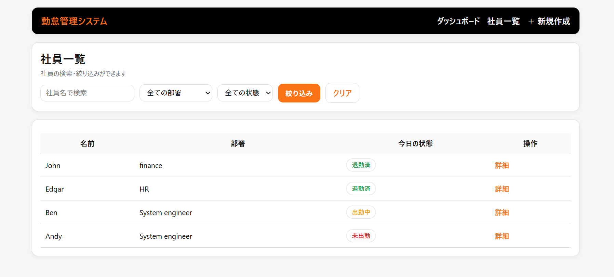
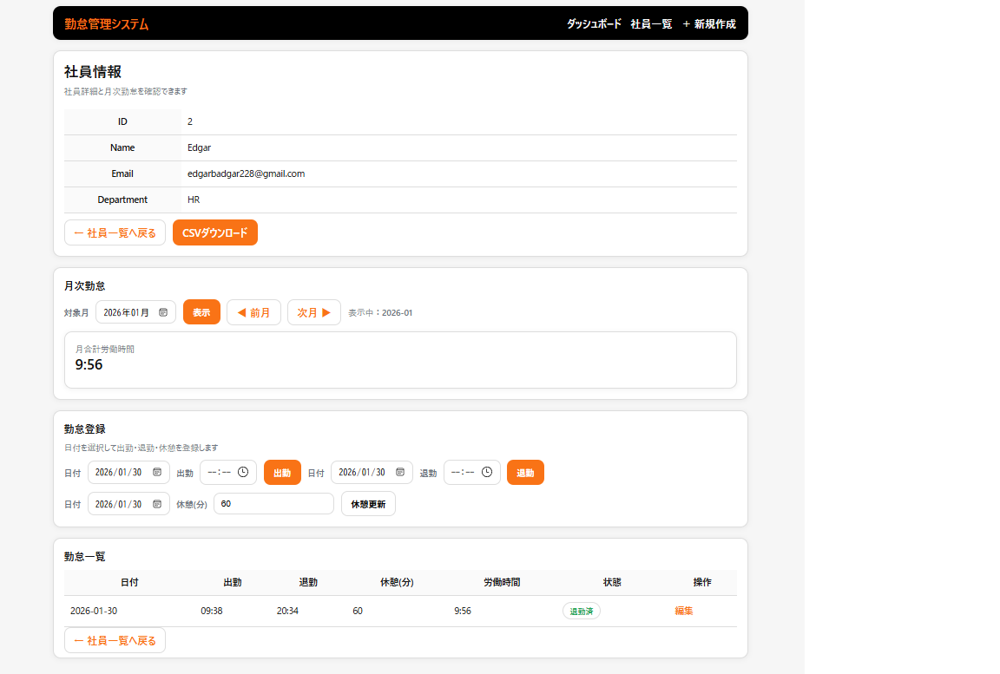
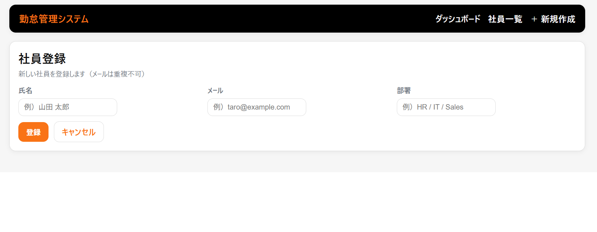
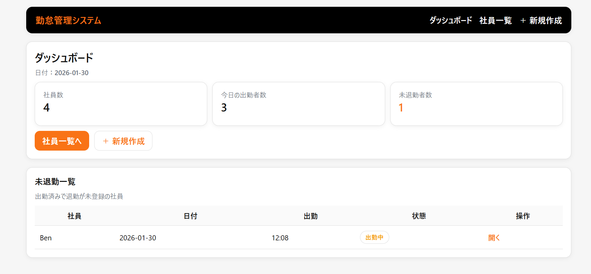
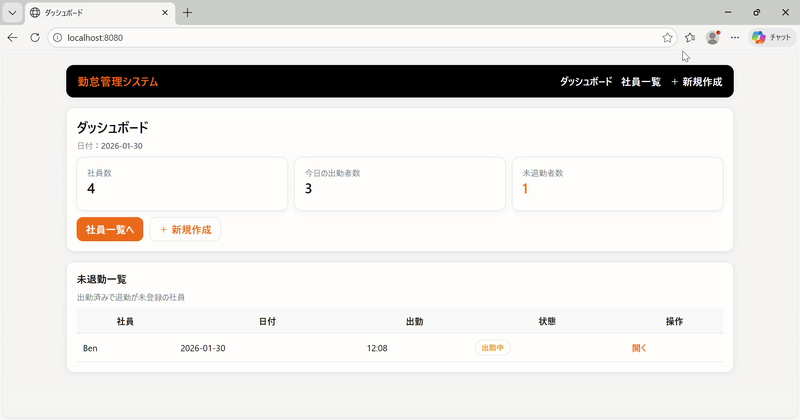
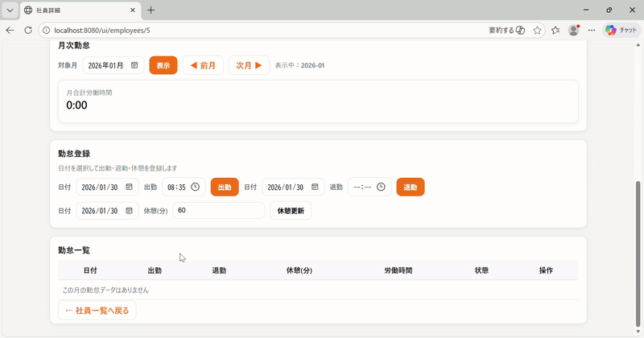

# 勤怠管理システム（Kintai）

## 目的
- 紙・Excel で行いがちな勤怠管理を Web 上で一元管理し、入力ミスや集計の手間を減らすことを目的とした社内向けアプリです。
- 社員情報の管理と、出勤・退勤の打刻を同じシステムで行い、勤務時間を自動集計できます。

---

## 機能一覧
- 社員の登録・更新・削除・一覧表示（CRUD）
- 出勤 / 退勤の打刻（勤怠登録）
- 勤務時間の自動計算（出勤〜退勤）
- 勤怠一覧の表示（社員別 / 日付別）
- メール重複の防止（DB の UNIQUE 制約）

### 画面一覧（Thymeleaf）
| 画面 | URL | 内容 |
|---|---|---|
| 社員一覧 | `/employees` | 社員一覧表示 |
| 社員登録 | `/employees/new` | 登録フォーム |
| 勤怠一覧 | `/attendances` | 勤怠一覧表示 |
| 打刻 | `/attendances/new` | 出勤/退勤登録 |

---

## 技術（スタック）
- Backend：Java 17 / Spring Boot（MVC, Spring Data JPA）
- Front：Thymeleaf
- DB：PostgreSQL
- Infra：Docker / Docker Compose
- Build：Maven

※ MVC 構成で Controller / Service / Repository に分け、画面遷移を含めた Web アプリの基本構成を学習しました。

---

<h2> スクリーンショット </h2>

<h3>社員一覧</h3>
<p align="center">
  
</p>

<h3>勤怠一覧</h3>
<p align="center">
  
</p>

<h3>新規作成</h3>
<p align="center">
  
</p>

<h3>ダッシュボード</h3>
<p align="center">
  
</p>

<h2>デモ</h2>
<p align="center">
  
</p>
<p align="center">
  
</p>

---

## 工夫した点
- 勤務時間は DB から取得した出勤・退勤時刻を元にサーバ側で計算し、退勤未登録（null）の場合は計算しないようにしました。
- Controller / Service / Repository に役割を分け、責務を意識して実装しました。
- 社員メールに UNIQUE 制約を付け、重複登録を DB レベルで防止しました。

---

## 動作確認
### 画面操作で確認
- ✅ 社員登録 → 一覧に表示されること
- ✅ 社員詳細 / 更新 / 削除ができること（CRUD 一通り）
- ✅ メール重複で登録できないこと（エラーメッセージ表示）
- ✅ 出勤登録ができること
- ✅ 退勤登録ができること（出勤済みの場合）
- ✅ 出勤〜退勤から勤務時間が計算され、一覧に表示されること
- ✅ 勤怠一覧が社員別 / 日付別に表示できること（実装に合わせて）

### DB（psql）で確認
- ✅ employees / attendances にレコードが作成・更新されること

---

## 起動方法（ローカル）

### 1) PostgreSQL（Docker）
```bash
docker compose up -d
docker cimpose ps
```
### 2) アプリ起動（PostgreSQL profile）

・PowerShell（Windows)
```powershell
$env:SPRING_PROFILES_ACTIVE="postgres"
./mvnw spring-boot:run
```

・Git Bash / macOS / Linux
```console
SPRING_PROFILES_ACTIVE=postgres ./mvnw spring-boot:run
```
### 3) アクセス
http://localhost:8080
停止
```bash
docker compose down -v
```

### docker compose がない場合の PostgreSQL 起動例

```bash
docker run -d --name kintai-postgres -p 5432:5432 \
  -e POSTGRES_DB=kintai \
  -e POSTGRES_USER=kintai \
  -e POSTGRES_PASSWORD=kintai \
  postgres:16
```


 
